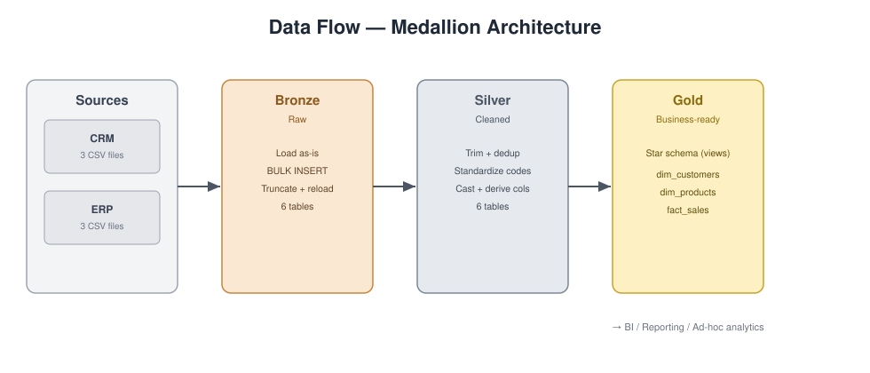
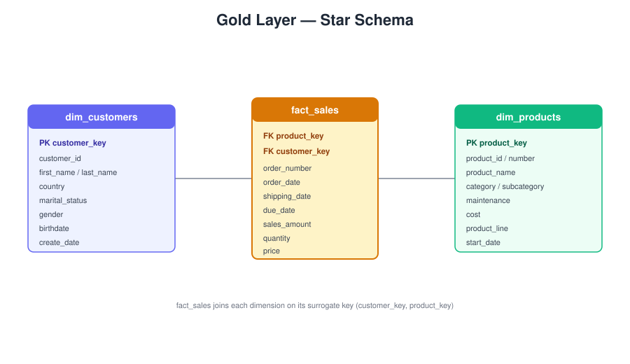

# SQL Data Warehouse

A modern SQL Server data warehouse built on the Medallion architecture (Bronze → Silver → Gold), covering ETL, data modeling, and an analytics-ready star schema. Source data comes from two systems — a CRM and an ERP — delivered as CSV files.

## Architecture

The warehouse organizes data into three layers, each a schema in the `DataWarehouse` database:

- **Bronze** — raw data loaded as-is from the source CSVs. No transformations; tables are truncated and reloaded on each run via `BULK INSERT`.
- **Silver** — cleaned and standardized data: trimming, deduplication, code-to-label mapping, type casting, and derived columns. Each table carries a `dwh_create_date` audit column.
- **Gold** — business-ready views modeled as a star schema (two dimensions and one fact) for analytics and reporting.



## Data model (Gold layer)

| View                 | Type      | Grain                     |
|----------------------|-----------|---------------------------|
| `gold.dim_customers` | Dimension | One row per customer      |
| `gold.dim_products`  | Dimension | One row per current product |
| `gold.fact_sales`    | Fact      | One row per sales order line |

`fact_sales` links to the dimensions through surrogate keys (`customer_key`, `product_key`). Full field-level documentation is in [`docs/data_catalog.md`](docs/data_catalog.md).



## Repository structure

```
SQL-DataWarehouse/
├── Datasets/                       -- source CSVs
│   ├── source_crm/                 -- cust_info, prd_info, sales_details
│   └── source_erp/                 -- CUST_AZ12, LOC_A101, PX_CAT_G1V2
├── docs/
│   ├── data_catalog.md             -- field-level docs for the Gold layer
│   ├── naming_conventions.md       -- table/column naming rules
│   ├── data_flow.svg               -- data-flow diagram
│   └── star_schema.svg             -- Gold star-schema diagram
├── scripts/
│   ├── init_database.sql           -- create DataWarehouse DB + bronze/silver/gold schemas
│   ├── Bronze/
│   │   ├── DDL _bronze.SQL         -- create bronze tables
│   │   └── proc_load_bronze.sql    -- bronze.load_bronze: BULK INSERT from CSVs
│   ├── Silver/
│   │   ├── ddl_silver.sql          -- create silver tables (+ dwh_create_date)
│   │   └── proc_load_silver.sql    -- silver.load_silver: transform bronze -> silver
│   └── Gold/
│       └── ddl_gold.sql            -- create gold star-schema views
└── tests/
    ├── quality_checks_silver.sql   -- data-quality checks on the Silver layer
    └── quality_checks_gold.sql     -- integrity checks on the Gold layer
```

## How to run

Run the scripts in order in SQL Server Management Studio (or `sqlcmd`):

1. `scripts/init_database.sql` — creates the database and the three schemas.
2. `scripts/Bronze/DDL _bronze.SQL` — creates the bronze tables.
3. `scripts/Bronze/proc_load_bronze.sql` — creates and runs `bronze.load_bronze` to load the CSVs.
   *(Update the `BULK INSERT` file paths to point at your local `Datasets` folder.)*
4. `scripts/Silver/ddl_silver.sql` — creates the silver tables.
5. `scripts/Silver/proc_load_silver.sql` — creates and runs `silver.load_silver` to populate silver from bronze.
6. `scripts/Gold/ddl_gold.sql` — creates the gold views.

Once the gold views exist, query them directly for analytics:

```sql
SELECT * FROM gold.dim_customers;
SELECT * FROM gold.dim_products;
SELECT * FROM gold.fact_sales;
```

To validate a load, run the scripts in `tests/` — `quality_checks_silver.sql` after the Silver load, `quality_checks_gold.sql` after the Gold views. Each query is written to return **no rows** when the data is clean.

## Key transformations (Silver layer)

- **Customers** — keep the most recent record per `cst_id` (deduplication), trim names, map marital-status and gender codes to readable labels.
- **Products** — split the product key into a category id and a product key, default missing cost to 0, map product-line codes, and derive `prd_end_dt` from the next version's start date.
- **Sales** — convert integer `yyyymmdd` dates to `DATE` (invalid values → `NULL`), recompute `sales` when missing or inconsistent (`quantity * price`), and derive `price` when invalid.
- **ERP customers** — strip the `NAS` prefix from ids, null out future birthdates, normalize gender.
- **ERP location** — normalize ids and country codes.

## Credits

Built following the *Data With Baraa* "SQL Data Warehouse from Scratch" tutorial.
